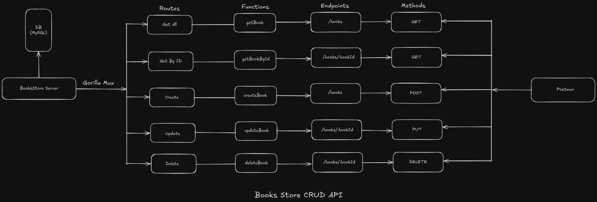

# Books Store CRUD API (with MySQL using GORM)

This is a simple Books Store CRUD API built using Go, Gorilla Mux, MySQL, and GORM. The API allows basic CRUD operations (Create, Read, Update, Delete) on a MySQL database for managing a collection of books.



## Project Overview

- **Framework:** Gorilla Mux
- **Database:** MySQL
- **ORM:** GORM
- **API Methods:** GET, POST, PUT, DELETE
- **Testing Tool:** Postman

## API Endpoints

| Method | Endpoint            | Function       | Description                  |
|--------|---------------------|----------------|---------------------------------|
| GET    | `/books`            | `getBook`      | Fetch all books                 |
| GET    | `/books/{bookId}`   | `getBookById`  | Fetch a book by ID              |
| POST   | `/books`            | `createBook`   | Add a new book                  |
| PUT    | `/books/{bookId}`   | `updateBook`   | Update an existing book by ID   |
| DELETE | `/books/{bookId}`   | `deleteBook`   | Delete a book by ID             |

## Project Structure

- **Routes:** Handled using Gorilla Mux.
- **Database:** MySQL integrated with GORM.
- **Functions:** CRUD operations using GORM methods.
- **Data Handling:** Persistent storage with MySQL.
- **Testing:** Postman can be used for API testing.

## Database Configuration

Database credentials are stored directly in the `pkg/config/app.go` file. Ensure the file contains the following configuration:

```go
	dsn := "<YOUR_DB_USERNAME>:<YOUR_DB_PASSWORD>@tcp(127.0.0.1:3306)/<YOUR_DB_NAME>?charset=utf8mb4&parseTime=True&loc=Local"
```


Built with ❤️ using Go, Gorilla Mux, GORM, and MySQL.
