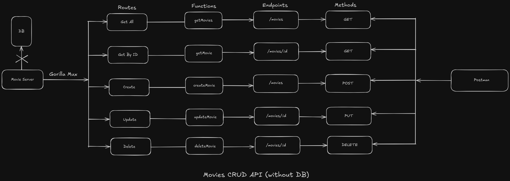

# Movies CRUD API (without DB)

This is a simple Movies CRUD API built using Go and Gorilla Mux. The API performs basic CRUD operations (Create, Read, Update, Delete) on a slice, instead of a database.

## Project Overview

- **Framework:** Gorilla Mux
- **Storage:** In-memory slice (no database)
- **API Methods:** GET, POST, PUT, DELETE
- **Testing Tool:** Postman

## API Endpoints

| Method | Endpoint         | Function       | Description               |
|--------|------------------|----------------|---------------------------|
| GET    | `/movies`        | `getMovies`    | Fetch all movies          |
| GET    | `/movies/{id}`   | `getMovie`     | Fetch a movie by ID       |
| POST   | `/movies`        | `createMovie`  | Add a new movie           |
| PUT    | `/movies/{id}`   | `updateMovie`  | Update a movie by ID      |
| DELETE | `/movies/{id}`   | `deleteMovie`  | Delete a movie by ID      |

## Project Structure

- **Routes:** Defined using Gorilla Mux.
- **Functions:** Handlers for CRUD operations.
- **Data Handling:** Movies data is stored in an in-memory slice.
- **Testing:** Use Postman to test the endpoints.

## Getting Started

1. Clone the repository.
2. Install dependencies: `go get -u github.com/gorilla/mux`
3. Run the server: `go run main.go`
4. Use Postman to interact with the API.

## Future Improvements
- Implement persistent storage with a database.
- Add unit tests and error handling.
- Enhance data validation.

---

Built with ❤️ using Go and Gorilla Mux.

