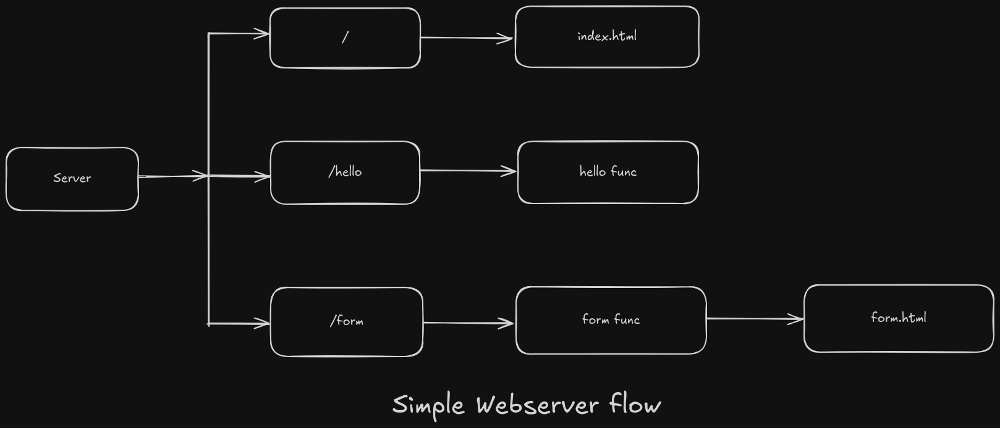

# Simple Go Web Server

This project is a basic web server implemented in Go. The server handles multiple routes and serves both static HTML files and dynamic content using handler functions.

## Flow Overview

The web server operates as follows:

1. **Root Route (`/`)**:
   - Serves the `index.html` file.

2. **Hello Route (`/hello`)**:
   - Executes the `hello` handler function, which returns a dynamic response.

3. **Form Route (`/form`)**:
   - Executes the `form` handler function.
   - Serves the `form.html` file for user input.

## How to Run
1. Ensure you have Go installed.
2. Clone the repository and navigate to the project directory.
3. Run the server with:
4. Open your browser and test the routes:
- `http://localhost:8080/`
- `http://localhost:8080/hello`
- `http://localhost:8080/form.html`

## Project Structure
- `main.go`: Entry point of the server.
- `index.html`: Homepage.
- `form.html`: Form page.
- Handler functions are defined directly in `main.go`.

## License
This project is open-source and available under the MIT License.
